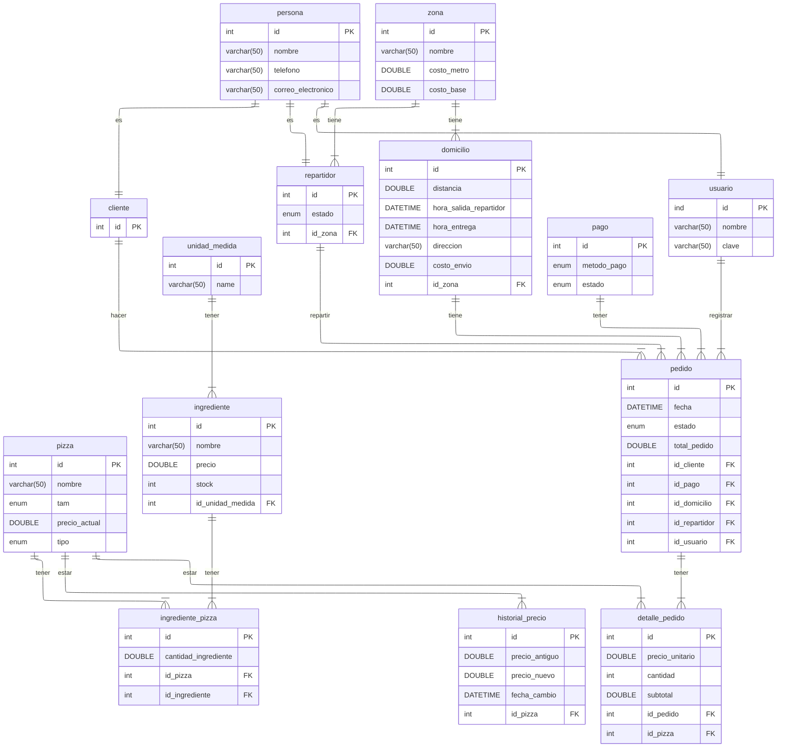

# Sistema de gestión de pedidos y domicilios Pizzería Don Piccolo

Este proyecto define la estructura de una base de datos en MySQL para gestionar las operaciones de pedidos y domicilios de la pizzería Don Piccolo, permite gestionar los clientes, pizzas, ingredientes, pedidos, repartidores, domicilios y pagos, lo que permite  gestionar la información completa del proceso de venta de pizzas y domicilios, desde el registro de pedidos hasta su entrega y pago.


## Tablas y relaciones



| Tabla | Propósito | Clave Primaria (PK) | Atributos|
| :--- | :--- | :--- | :--- |
| **`persona`** | Base para clientes, repartidores y usuarios. | `id` | `nombre`, `telefono`, `correo_electronico`. |
| **`cliente`** | Entidad que realiza pedidos. | `id` | Hereda de `persona`. |
| **`usuario`** | Personal con acceso al sistema (e.g., para registro de pedidos). | `id` | Hereda de `persona`. Incluye `nombre` (usuario) y `clave`. |
| **`repartidor`** | Personal encargado de las entregas. | `id` | Hereda de `persona`. Incluye `estado`, `id_zona` (FK). |
| **`pizza`** | Catálogo de productos ofrecidos. | `id` | `nombre`, `tam` (tamaño), `precio_actual`, `tipo`. |
| **`ingrediente`** | Inventario de materias primas. | `id` | `nombre`, `precio`, `stock`, `id_unidad_medida` (FK). |
| **`unidad_medida`** | Define unidades para el inventario (e.g., gramos, litros). | `id` | `name`. |
| **`ingrediente_pizza`** | Define la receta: ingredientes y cantidad por pizza. | `id` | `cantidad_ingrediente`, `id_pizza` (FK), `id_ingrediente` (FK). |
| **`pedido`** | Registro de cada orden de compra. | `id` | `fecha`, `estado`, `total_pedido`. Incluye FKs a `cliente`, `pago`, `domicilio`, `repartidor`, `usuario`. |
| **`detalle_pedido`** | Líneas de pedido que detallan las pizzas compradas. | `id` | `precio_unitario`, `cantidad`, `subtotal`, `id_pedido` (FK), `id_pizza` (FK). |
| **`pago`** | Información sobre el método y estado de la transacción. | `id` | `metodo_pago`, `estado`. |
| **`zona`** | Áreas geográficas para logística y cálculo de envíos. | `id` | `nombre`, `costo_metro`, `costo_base`. |
| **`domicilio`** | Detalles específicos de la entrega y tiempos. | `id` | `distancia`, `direccion`, `costo_envio`, `hora_salida_repartidor`, `hora_entrega`, `id_zona` (FK). |
| **`historial_precio`** | Trazabilidad de los cambios en el costo de las pizzas. | `id` | `precio_antiguo`, `precio_nuevo`, `fecha_cambio`, `id_pizza` (FK). |


 **`persona`** $\leftrightarrow$ **`cliente`**: Una persona *puede ser* un cliente.

 **`persona`** $\leftrightarrow$ **`usuario`**: Una persona *puede ser* un usuario del sistema.

 **`persona`** $\leftrightarrow$ **`repartidor`**: Una persona *puede ser* un repartidor.

 **`cliente`** **hacer** **`pedido`** (1:N): Un cliente puede hacer varios pedidos pero cada pedido se asocia a un cliente.

 **`usuario`** **registrar** **`pedido`** (1:N): Un usuario puede registrar varios pedidos y cada pedido se asocia a usuario.

 **`pago`** **tener** **`pedido`** (1:N): Un pago puede estar en varios pedidos y cada pedido se asocia a un pago.

 **`domicilio`** **tiene** **`pedido`** (1:N): Un domicilio puede estar en varios pedidos pero cada pedido se asocia a un domicilio.

 **`repartidor`** **repartir** **`pedido`** (1:N): Un repartidor puede repartir varios pedidos y varios pedidos se asocian a un repartidor.

 **`pedido`** **tener** **`detalle_pedido`** (1:N): Un pedido contiene varias líneas de detalle y los detalles del pedido se asocian a un pedido.

 **`pizza`** **estar** **`detalle_pedido`** (1:N): Una pizza puede estar en muchos detalles y cada detalle se asocia a una sola pizza.

 **`pizza`** $\leftrightarrow$ **`historial_precio`** (1:N): Una pizza puede estar varias veces en un historial pero cada hsitorial se asocia a una pizza.

 **`unidad_medida`** **tener** **`ingrediente`** (1:N): Una unidad de medida puede aplicar a varios ingredientes pero cada ingredinete va a estar asocidado con una uniad de medida.

 **`pizza`** $\leftrightarrow$ **`ingrediente_pizza`** $\leftrightarrow$ **`ingrediente`** (**M:N**): Guarda los ingredientes que contiene una pizza.

 **`zona`** **tiene** **`repartidor`** (1:N): Una zona tiene asignados varios repartidores y cada repartidor va a estar asociado a una sola zona.

 **`zona`** **tiene** **`domicilio`** (1:N): Una zona puede estar en varios domicilios pero cada domicilio esta asociada a una sola zona.

 ## Ejemplos de consultas

### 1. Clientes con Pedidos en un Rango de Fechas


```sql
SELECT p.nombre AS cliente, COUNT(pe.id) AS cantidad_pedidos_reaizados FROM pedido pe INNER JOIN persona p ON pe.id_cliente = p.id WHERE pe.fecha BETWEEN '2025-01-01' AND '2025-01-12' GROUP BY p.nombre ;
```
### 2. Pizzas más vendidas

```sql
SELECT p.nombre, SUM(dp.cantidad) AS cantidad_vendida FROM detalle_pedido dp INNER JOIN pizza p ON p.id = dp.id_pizza GROUP BY p.nombre ORDER BY cantidad_vendida DESC LIMIT 5;
```

### 3. Pedidos por repartidor

```sql
SELECT p.nombre AS repartidor, COUNT(pe.id) AS cantidad_pedidos_repartidos FROM pedido pe INNER JOIN persona p ON p.id = pe.id_repartidor GROUP BY p.nombre ORDER BY cantidad_pedidos_repartidos DESC;
```

## Ejecutar Script

1. Crear la base de datos

```sql
CREATE DATABASE pizzeria_don_piccoro;
```

2. Cambiar a la base de datos creada

```sql
USE pizzeria_don_piccoro;
```

3. Creamos las tablas

```sql
- Crear tabla persona

CREATE TABLE persona (
    id INT NOT NULL AUTO_INCREMENT,
    nombre VARCHAR(50) NOT NULL,
    telefono VARCHAR(50) NOT NULL,
    correo_electronico VARCHAR(50) NOT NULL,
    PRIMARY KEY (id)
);

-- Crear tabla usuario

CREATE TABLE usuario(
    id INT NOT NULL,
    usuario VARCHAR(50) NOT NULL,
    clave VARCHAR(50) NOT NULL,
    PRIMARY KEY (id),
    FOREIGN KEY (id) REFERENCES persona(id)
);

-- Crear tabla cliente

CREATE TABLE cliente (
    id INT NOT NULL,
    PRIMARY KEY (id),
    FOREIGN KEY (id) REFERENCES persona(id)
);

-- Crear tabla pizza

CREATE TABLE pizza (
    id INT NOT NULL AUTO_INCREMENT,
    nombre VARCHAR(50) NOT NULL,
    tam ENUM('Grande','Mediana','pequeña') NOT NULL,
    precio_actual DOUBLE NOT NULL,
    tipo ENUM('vegetariana','especial','clasica') NOT NULL,
    PRIMARY KEY (id)
);

-- Crear tabla unidad_medida

CREATE TABLE unidad_medida (
    id INT NOT NULL AUTO_INCREMENT,
    nombre VARCHAR(50) NOT NULL,
    PRIMARY KEY (id)
);

-- Crear tabla ingrediente

CREATE TABLE ingrediente (
    id INT NOT NULL AUTO_INCREMENT,
    nombre VARCHAR(50) NOT NULL,
    precio DOUBLE NOT NULL,
    stock INT NOT NULL,
    stock_minimo INT NOT NULL,
    id_unidad_medida INT NOT NULL,
    PRIMARY KEY (id),
    FOREIGN KEY (id_unidad_medida) REFERENCES unidad_medida(id)
);

-- Crear tabla ingrediente_pizza

CREATE TABLE ingrediente_pizza (
    id INT NOT NULL AUTO_INCREMENT,
    cantidad_ingrediente DOUBLE NOT NULL,
    id_pizza INT NOT NULL,
    id_ingrediente INT NOT NULL,
    PRIMARY KEY (id),
    FOREIGN KEY (id_pizza) REFERENCES pizza(id),
    FOREIGN KEY (id_ingrediente) REFERENCES ingrediente(id)
);

-- Crear tabla pago

CREATE TABLE pago (
    id INT NOT NULL AUTO_INCREMENT,
    metodo_pago ENUM('efectivo','tarjeta','app') NOT NULL, 
    estado ENUM('pagado','no pagado') NOT NULL,
    PRIMARY KEY (id)
);

-- Crear tabla zona

CREATE TABLE zona (
    id INT NOT NULL AUTO_INCREMENT,
    nombre VARCHAR(50) NOT NULL,
    costo_metro DOUBLE NOT NULL,
    costo_base DOUBLE NOT NULL,
    PRIMARY KEY (id)
);

-- Crear tabla repartidor

CREATE TABLE repartidor (
    id INT NOT NULL,
    estado ENUM('disponible','no disponible') NOT NULL,
    id_zona INT NOT NULL,
    PRIMARY KEY (id),
    FOREIGN KEY (id) REFERENCES persona(id),
    FOREIGN KEY (id_zona) REFERENCES zona(id)
);

-- Crear tabla domicilio

CREATE TABLE domicilio (
    id INT NOT NULL AUTO_INCREMENT,
    distancia DOUBLE NOT NULL,
    hora_salida_repartidor DATETIME,
    hora_entrega DATETIME,
    direccion VARCHAR(50) NOT NULL,
    costo_envio DOUBLE NOT NULL,
    id_zona INT NOT NULL,
    PRIMARY KEY (id),
    FOREIGN KEY (id_zona) REFERENCES zona(id)
);

-- Crear tabla pedido

CREATE TABLE pedido (
    id INT NOT NULL AUTO_INCREMENT,
    fecha DATETIME NOT NULL,
    estado ENUM('pendiente','en preparacion','entregado', 'cancelado') NOT NULL,
    total_pedido DOUBLE NOT NULL,
    id_cliente INT NOT NULL,
    id_pago INT NOT NULL,
    id_domicilio INT NOT NULL,
    id_repartidor INT NOT NULL,
    id_usuario INT NOT NULL,
    PRIMARY KEY (id),
    FOREIGN KEY (id_cliente) REFERENCES cliente(id),
    FOREIGN KEY (id_pago) REFERENCES pago(id),
    FOREIGN KEY (id_domicilio) REFERENCES domicilio(id),
    FOREIGN KEY (id_repartidor) REFERENCES repartidor(id),
    FOREIGN KEY (id_usuario) REFERENCES usuario(id)
);

-- Crear tabla detalle_pedido

CREATE TABLE detalle_pedido (
    id INT NOT NULL AUTO_INCREMENT,
    precio_unitario DOUBLE NOT NULL,
    cantidad INT NOT NULL,
    subtotal DOUBLE NOT NULL,
    id_pedido INT NOT NULL,
    id_pizza INT NOT NULL,
    PRIMARY KEY (id),
    FOREIGN KEY (id_pedido) REFERENCES pedido(id),
    FOREIGN KEY (id_pizza) REFERENCES pizza(id)
);

-- Crear tabla historial_precio

CREATE TABLE historial_precio (
    id INT NOT NULL AUTO_INCREMENT,
    precio_antiguo DOUBLE NOT NULL,
    precio_nuevo DOUBLE NOT NULL,
    id_pizza INT NOT NULL, 
    fecha_cambio DATETIME DEFAULT NOW() NOT NULL, 
    PRIMARY KEY (id),
    FOREIGN KEY (id_pizza) REFERENCES pizza(id)
);
```
3. Insertar datos

Accede al archivo **incerciones.sql**  que se encuentra en el repositorio donde se encunetran los datos listos para intorducrilos a la base de datos